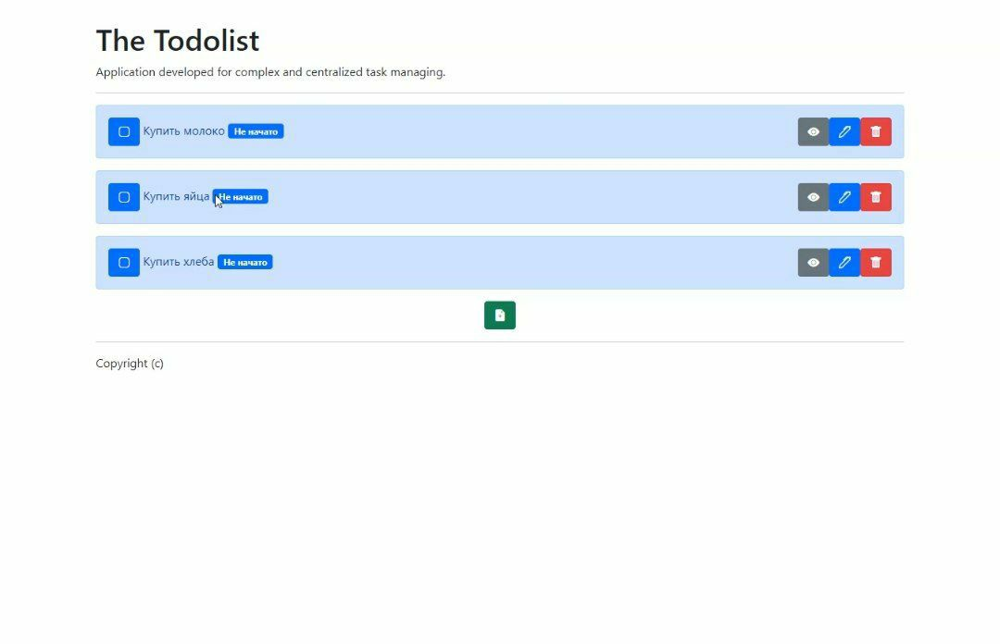
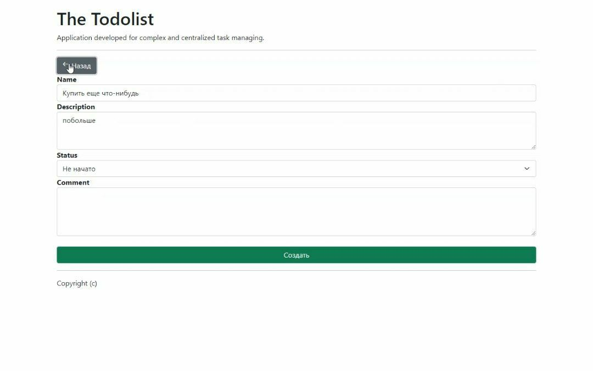
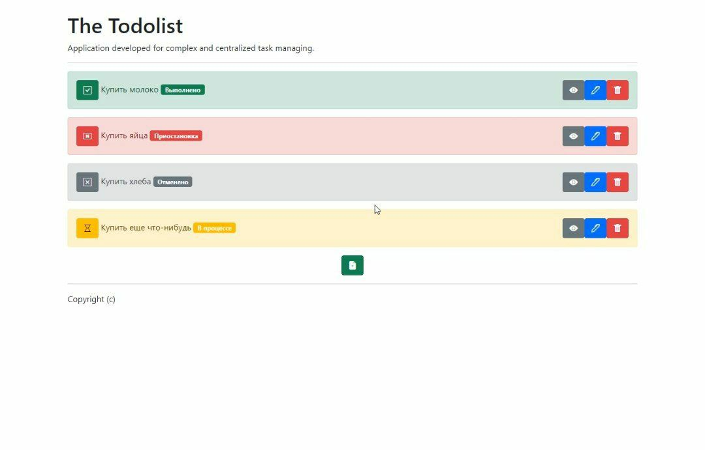

# Установка

1. Скачать и установить актуальную версию NodeJS (<https://nodejs.org/en/>)

2. Переименовать файл ".env-sample" в ".env" и заполнить соотвествующие поля данными базы данных MySQL

3. Создать базу данных MySQL с указанным ранее в пункте 2 названием (DB_NAME).

4. Запустить скрипт start.bat (если у вас Windows) или start.sh (если у вас Linux)

5. Готово! Приложение будет работать пока окошко консоли start.bat/start.sh открыто. (закрыть можно нажав по нему крестик, как и с любым другим приложением)

6. Результаты

